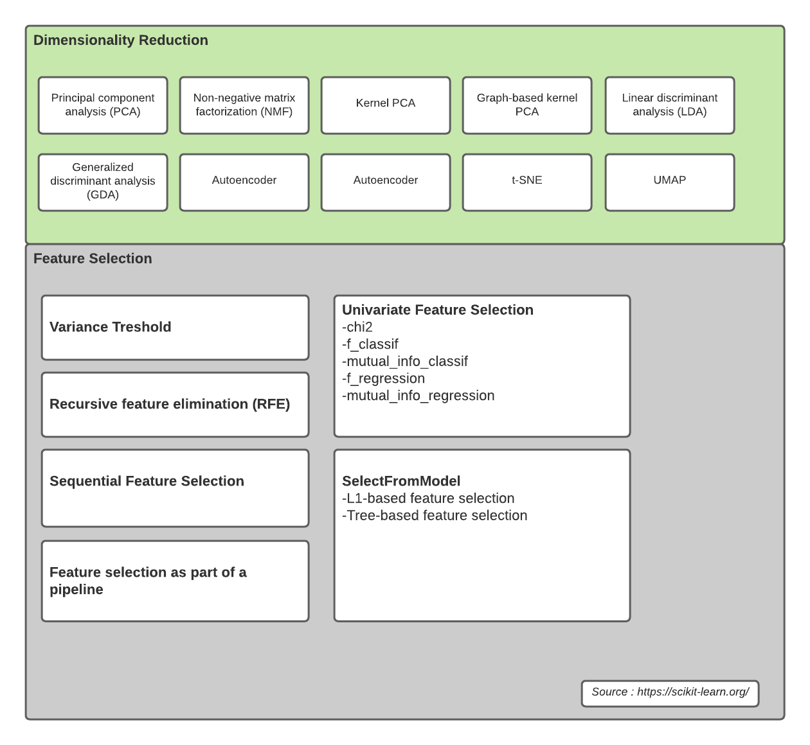

# Feature Selection

Sesuai dengan namanya, feature selection ini mengeluarkan variabel-variabel yang tidak memberikan kontribusi yang signifikan dalam pembentukan model.

## Feature Selection vs Dimentiooality Reduction
Keduanya memiliki fungsi yang sama untuk mengatasi dimensi data yang tinggi. Perbedaanya adalah **Dimentionality Reduction** mengatasi dimensi data yang tinggi dengan cara membentuk variabel baru, sedangkan **Feature Selection** tidak membentuk variabel baru namun hanya meng-eliminasi beberapa variabel saja.

## Type

## Source
- https://github.com/scikit-learn/scikit-learn/blob/ef5cb84a/sklearn/feature_selection/univariate_selection.py#L368
- https://scikit-learn.org/stable/modules/feature_selection.html#variance-threshold

